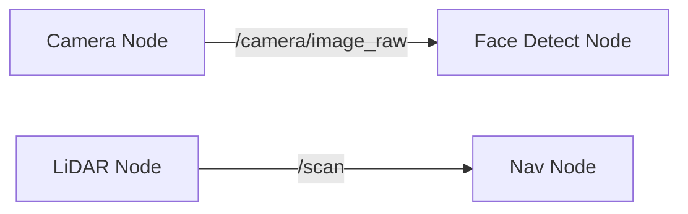

# ROS 2: The Robotic Nervous System - Fundamentals

## 2.1 Why ROS 2?

Building a robot from scratch is hard. You need drivers for cameras, communication protocols for motors, and logging systems. **ROS 2 (Robot Operating System 2)** provides this infrastructure. It is not an OS in the Windows/Linux sense, but a **middleware** that handles communication between different parts of your robot.

If the robot is the body, ROS 2 is the nervous system.

### ROS 1 vs. ROS 2
*   **ROS 1**: Relied on a central "Master" node. Single point of failure. Not real-time safe.
*   **ROS 2**: Distributed (DDS - Data Distribution Service). Real-time capable. Secure. Industry grade.

## 2.2 Core Concepts: The Graph

A ROS 2 system is a network of independent programs called **Nodes** that communicate via a graph.

### 2.2.1 Nodes
A **Node** is a process that performs a specific computation.
*   *Example*: One node reads the Camera, another node detects faces, a third node controls the neck motors.
*   *Benefit*: Modularity. If the face detector crashes, the camera node keeps running.

### 2.2.2 Topics (Pub/Sub)
Topics are the primary way nodes exchange data. It is a **Many-to-Many** asynchronous communication pattern.
*   **Publisher**: Broadcasts data (e.g., "Here is the current image").
*   **Subscriber**: Listens for data (e.g., "I need images to find faces").



### 2.2.3 Services (Req/Res)
Services are **One-to-One** synchronous communication.
*   **Client**: "Please open the gripper."
*   **Server**: "OK, opening gripper..." -> [Action] -> "Done."

### 2.2.4 Actions
Actions are for long-running tasks with feedback.
*   *Example*: "Walk to the kitchen."
*   *Feedback*: "Walking... 10%... 50%... Arrived."

## 2.3 Workshop: Your First ROS 2 Package

We will build a simple "Digital Twin" controller using Python.

### Prerequisites
*   Ubuntu 22.04 / Windows WSL2
*   ROS 2 Humble / Jazzy
*   Python 3.10+

### Step 1: Create a Workspace
```bash
mkdir -p ~/ros2_ws/src
cd ~/ros2_ws/src
```

### Step 2: Create a Package
```bash
ros2 pkg create --build-type ament_python my_robot_controller
```

### Step 3: Write a Publisher Node
Create `my_robot_controller/publisher.py`:

```python
import rclpy
from rclpy.node import Node
from std_msgs.msg import String

class HeartbeatNode(Node):
    def __init__(self):
        super().__init__('heartbeat_node')
        self.publisher_ = self.create_publisher(String, 'heartbeat', 10)
        self.timer = self.create_timer(1.0, self.timer_callback)
        self.get_logger().info("Heartbeat Node Started")

    def timer_callback(self):
        msg = String()
        msg.data = 'Robot System: ALIVE'
        self.publisher_.publish(msg)
        self.get_logger().info(f'Publishing: "{msg.data}"')

def main(args=None):
    rclpy.init(args=args)
    node = HeartbeatNode()
    rclpy.spin(node)
    rclpy.shutdown()
```

### Step 4: Build and Run
```bash
cd ~/ros2_ws
colcon build
source install/setup.bash
ros2 run my_robot_controller heartbeat_node
```

You have just created your first pulse in the nervous system of your future humanoid!
